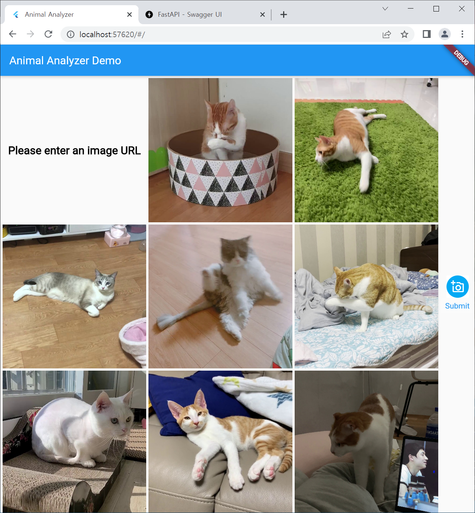

# Animal Analyzer

# Demo video link
https://drive.google.com/file/d/1mzg4tuL2DfZRmsWOV-dDJHnJbdCehZot/view?usp=sharing

## Development Requirement

    flutter v3.0.1

    python v3.9.1
    fastapi v0.78.0
    uvicorn v0.17.6

    tensorflow v2.5.0
    scikit-learn v1.0.1
    pillow v9.1.1
    pandas v1.3.4
    numpy v1.19.5

## Getting Started

    pip install fastapi
    pip install uvicorn[standard]
    cd fastapi
    uvicorn main:app --reload

    cd ../app
    flutter run

## Classifier Model Changes

https://github.com/ljh415/AI_PBL_TF
- Change parameter type from argument to dictionary in Inference __init__() because it conflicts with uvicorn app.
- Add feature that encodes and decodes with bytearray to handle network image with URL.
- It works well in current uvicorn app using REST API, but may not work independently due to path issue. Handling the path is under the development :/